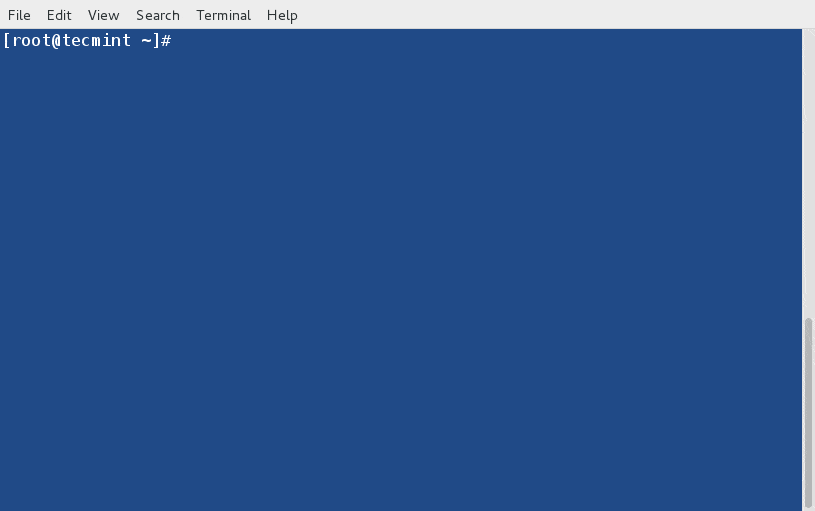
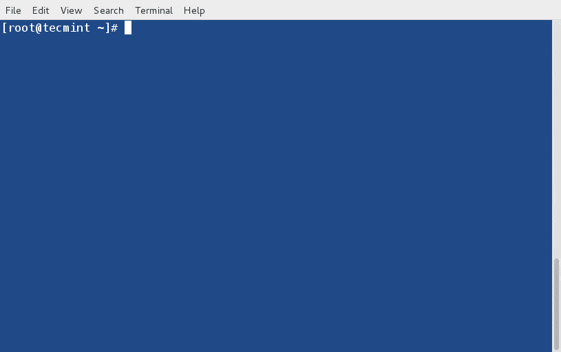
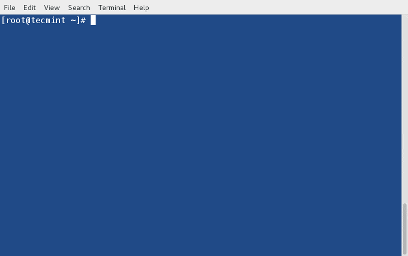
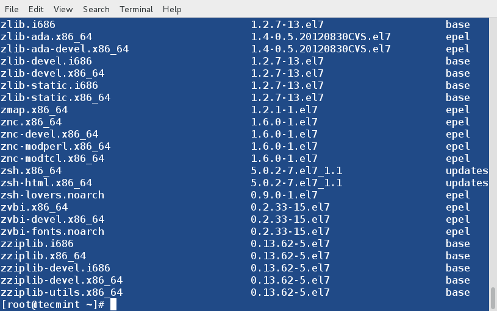
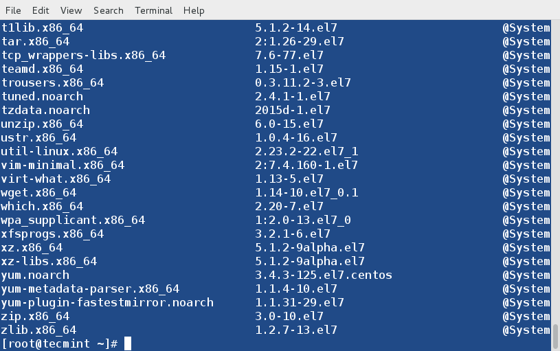
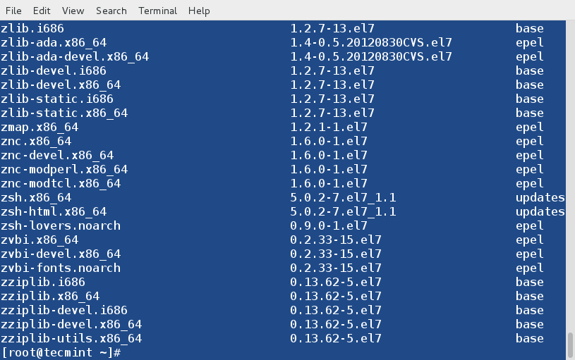
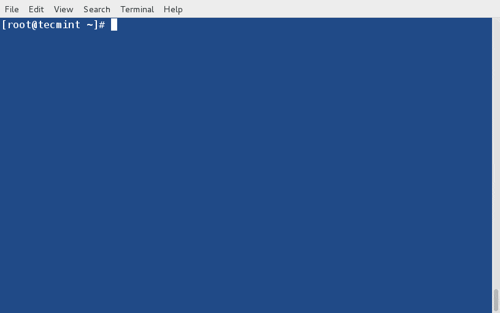
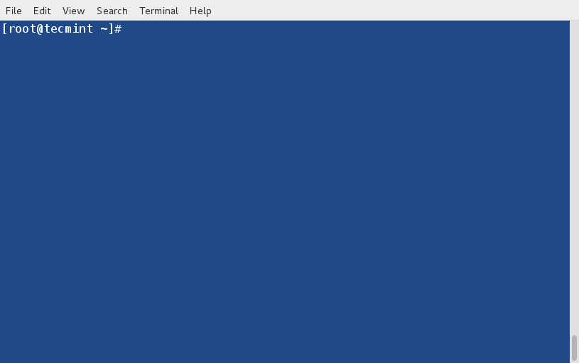
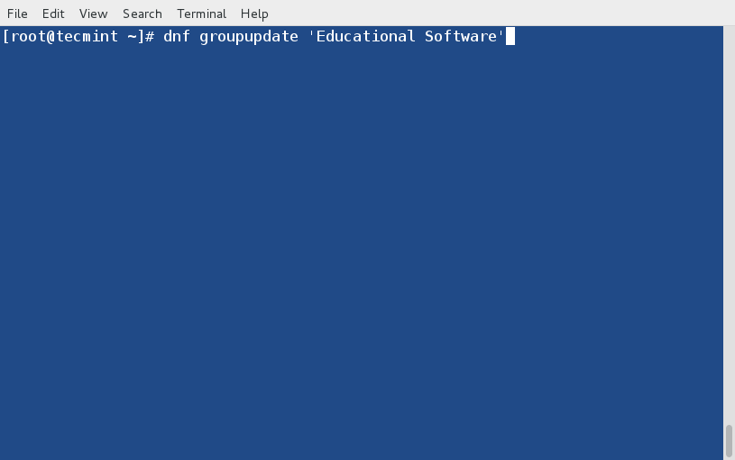
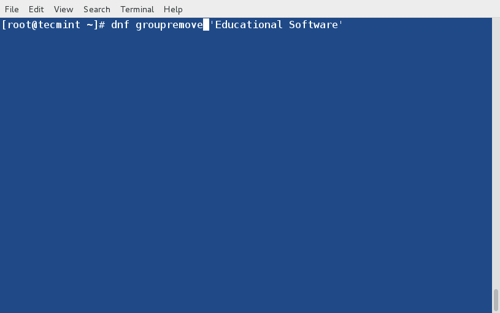

**DNF**是新一代的[rpm](#/rpm "rpm命令")软件包管理器。他首先出现在 Fedora 18 这个发行版中。而最近，它取代了[yum](#/yum "yum命令")，正式成为 Fedora 22 的包管理器。

DNF包管理器克服了YUM包管理器的一些瓶颈，提升了包括用户体验，内存占用，依赖分析，运行速度等多方面的内容。DNF使用 RPM, libsolv 和 hawkey 库进行包管理操作。尽管它没有预装在 CentOS 和 RHEL 7 中，但你可以在使用 YUM 的同时使用 DNF 。你可以在这里获得关于 DNF 的更多知识：[《 DNF 代替 YUM ，你所不知道的缘由》](http://www.tecmint.com/dnf-next-generation-package-management-utility-for-linux/)

DNF 的最新稳定发行版版本号是 1.0，发行日期是2015年5月11日。 这一版本的额 DNF 包管理器（包括在他之前的所有版本） 都大部分采用 Python 编写，发行许可为GPL v2.

### 安装 DNF 包管理器  

DNF 并未默认安装在 RHEL 或 CentOS 7系统中，但是 Fedora 22 已经默认使用 DNF .

1、为了安装 DNF ，您必须先安装并启用 epel-release 依赖。

在系统中执行以下命令：

```
# yum [install](#/install "install命令") epel-release
```

或者

```
# yum install epel-release -y
```

其实这里并没有强制使用”-y”的理由，相反的，在不使用”-y”的情况下，用户可以在安装过程中查看到底有哪些东西被安装进了系统。但对于没有这个需求的用户，您可以在 YUM 中使用”-y”参数来自动安装所有东西。

2、使用 epel-release 依赖中的 YUM 命令来安装 DNF 包。在系统中执行以下命令：

```
# yum install dnf
```

然后， DNF 包管理器就被成功的安装到你的系统中了。接下来，是时候开始我们的教程了！在这个教程中，您将会学到27个用于 DNF 包管理器的命令。使用这些命令，你可以方便有效的管理您系统中的 RPM 软件包。现在，让我们开始学习 DNF 包管理器的27条常用命令吧！

**查看 DNF 包管理器版本**

用处：该命令用于查看安装在您系统中的 DNF 包管理器的版本

```
# dnf –version
```



**查看系统中可用的 DNF 软件库**

用处：该命令用于显示系统中可用的 DNF 软件库

```
# dnf repolist
```



**查看系统中可用和不可用的所有的 DNF 软件库**

用处：该命令用于显示系统中可用和不可用的所有的 DNF 软件库

```
# dnf repolist all
```



**列出所有 RPM 包**

用处：该命令用于列出用户系统上的所有来自软件库的可用软件包和所有已经安装在系统上的软件包

```
# dnf list
```



**列出所有安装了的 RPM 包**

用处：该命令用于列出所有安装了的 RPM 包

```
# dnf list installed
```



**列出所有可供安装的 RPM 包**

用处：该命令用于列出来自所有可用软件库的可供安装的软件包

```
# dnf list available
```



**搜索软件库中的 RPM 包**

用处：当你不知道你想要安装的软件的准确名称时，你可以用该命令来搜索软件包。你需要在”search”参数后面键入软件的部分名称来搜索。（在本例中我们使用”[nano](#/nano "nano命令")”）

```
# dnf search nano
```


**查找某一文件的提供者**

用处：当你想要查看是哪个软件包提供了系统中的某一文件时，你可以使用这条命令。（在本例中，我们将查找”/bin/bash”这个文件的提供者）

```
# dnf provides /bin/bash
```


**查看软件包详情**

用处：当你想在安装某一个软件包之前查看它的详细信息时，这条命令可以帮到你。（在本例中，我们将查看”nano”这一软件包的详细信息）

```
# dnf [info](#/info "info命令") nano
```


**安装软件包**

用处：使用该命令，系统将会自动安装对应的软件及其所需的所有依赖（在本例中，我们将用该命令安装nano软件）

```
# dnf install nano
```


**升级软件包**

用处：该命令用于升级制定软件包（在本例中，我们将用命令升级”systemd”这一软件包）

```
# dnf update systemd
```


**检查系统软件包的更新**

用处：该命令用于检查系统中所有软件包的更新

```
# dnf check-update
```


**升级所有系统软件包**

用处：该命令用于升级系统中所有有可用升级的软件包

```
# dnf update 或 # dnf upgrade
```



**删除软件包**

用处：删除系统中指定的软件包（在本例中我们将使用命令删除”nano”这一软件包）

```
# dnf remove nano 或 # dnf erase nano
```


**删除无用孤立的软件包**

用处：当没有软件再依赖它们时，某一些用于解决特定软件依赖的软件包将会变得没有存在的意义，该命令就是用来自动移除这些没用的孤立软件包。

```
# dnf autoremove
```


**删除缓存的无用软件包**

用处：在使用 DNF 的过程中，会因为各种原因在系统中残留各种过时的文件和未完成的编译工程。我们可以使用该命令来删除这些没用的垃圾文件。

```
# dnf clean all
```



**获取有关某条命令的使用帮助**

用处：该命令用于获取有关某条命令的使用帮助（包括可用于该命令的参数和该命令的用途说明）（本例中我们将使用命令获取有关命令”clean”的使用帮助）

```
# dnf [help](#/help "help命令") clean
```


**查看所有的 DNF 命令及其用途**

用处：该命令用于列出所有的 DNF 命令及其用途

```
# dnf help
```


**查看 DNF 命令的执行历史**

用处：您可以使用该命令来查看您系统上 DNF 命令的执行历史。通过这个手段您可以知道在自您使用 DNF 开始有什么软件被安装和卸载。

```
# dnf [history](#/history "history命令")
```


**查看所有的软件包组**

用处：该命令用于列出所有的软件包组

```
# dnf grouplist
```


**安装一个软件包组**

用处：该命令用于安装一个软件包组（本例中，我们将用命令安装”Educational Software”这个软件包组）

```
# dnf groupinstall ‘Educational Software’
```


**升级一个软件包组中的软件包**

用处：该命令用于升级一个软件包组中的软件包（本例中，我们将用命令升级”Educational Software”这个软件包组中的软件）

```
# dnf groupupdate ‘Educational Software’
```



**删除一个软件包组**

用处：该命令用于删除一个软件包组（本例中，我们将用命令删除”Educational Software”这个软件包组）

```
# dnf groupremove ‘Educational Software’
```



**从特定的软件包库安装特定的软件**

用处：该命令用于从特定的软件包库安装特定的软件（本例中我们将使用命令从软件包库 epel 中安装 phpmyadmin 软件包）

```
# dnf –enablerepo=epel install phpmyadmin
```

**更新软件包到最新的稳定发行版**

用处：该命令可以通过所有可用的软件源将已经安装的所有软件包更新到最新的稳定发行版

```
# dnf distro-[sync](#/sync "sync命令")
```

**重新安装特定软件包**

用处：该命令用于重新安装特定软件包（本例中，我们将使用命令重新安装”nano”这个软件包）

```
# dnf reinstall nano
```


**回滚某个特定软件的版本**

用处：该命令用于降低特定软件包的版本（如果可能的话）（本例中，我们将使用命令降低”acpid”这个软件包的版本）

```
# dnf downgrade acpid
```

样例输出：

```
Using metadata from Wed May 20 12:44:59 2015
No match for available package: acpid-2.0.19-5.el7.x86_64
Error: Nothing to do.
```

原作者注：在执行这条命令的时候， DNF 并没有按照我期望的那样降级指定的软件（“acpid”）。该问题已经上报。

### 总结  

DNF 包管理器作为 YUM 包管理器的升级替代品，它能自动完成更多的操作。但在我看来，正因如此，所以 DNF 包管理器不会太受那些经验老道的 Linux 系统管理者的欢迎。举例如下：

1.  在 DNF 中没有 –skip-broken 命令，并且没有替代命令供选择。
2.  在 DNF 中没有判断哪个包提供了指定依赖的 resolvedep 命令。
3.  在 DNF 中没有用来列出某个软件依赖包的 deplist 命令。
4.  当你在 DNF 中排除了某个软件库，那么该操作将会影响到你之后所有的操作，不像在 YUM 下那样，你的排除操作只会咋升级和安装软件时才起作用。