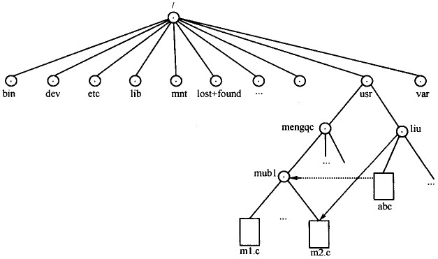

**ln命令**用来为文件创件连接，连接类型分为硬连接和符号连接两种，默认的连接类型是硬连接。如果要创建符号连接必须使用"-s"选项。

注意：符号链接文件不是一个独立的文件，它的许多属性依赖于源文件，所以给符号链接文件设置存取权限是没有意义的。

### 语法  

```
ln(选项)(参数)
```

### 选项  

```
-b或--backup：删除，覆盖目标文件之前的备份；
-d或-F或——directory：建立目录的硬连接；
-f或——force：强行建立文件或目录的连接，不论文件或目录是否存在；
-i或——interactive：覆盖既有文件之前先询问用户；
-n或--no-dereference：把符号连接的目的目录视为一般文件；
-s或——symbolic：对源文件建立符号连接，而非硬连接；
-S<字尾备份字符串>或--suffix=<字尾备份字符串>：用"-b"参数备份目标文件后，备份文件的字尾会被加上一个备份字符串，预设的备份字符串是符号“~”，用户可通过“-S”参数来改变它；
-v或——verbose：显示指令执行过程；
-V<备份方式>或--version-control=<备份方式>：用“-b”参数备份目标文件后，备份文件的字尾会被加上一个备份字符串，这个字符串不仅可用“-S”参数变更，当使用“-V”参数<备份方式>指定不同备份方式时，也会产生不同字尾的备份字符串；
--[help](#/help "help命令")：在线帮助；
--version：显示版本信息。
```

### 参数  

*   源文件：指定连接的源文件。如果使用`-s`选项创建符号连接，则“源文件”可以是文件或者目录。创建硬连接时，则“源文件”参数只能是文件；
*   目标文件：指定源文件的目标连接文件。

### 实例  

将目录`/usr/mengqc/mub1`下的文件m2.c链接到目录`/usr/liu`下的文件a2.c

```
[cd](#/cd "cd命令") /usr/mengqc
ln /mub1/m2.c /usr/liu/a2.c
```

在执行ln命令之前，目录`/usr/liu`中不存在a2.c文件。执行ln之后，在`/usr/liu`目录中才有a2.c这一项，表明m2.c和a2.c链接起来（注意，二者在物理上是同一文件），利用`[ls](#/ls "ls命令") -l`命令可以看到链接数的变化。

在目录`/usr/liu`下建立一个符号链接文件abc，使它指向目录`/usr/mengqc/mub1`

```
ln -s /usr/mengqc/mub1 /usr/liu/abc
```

执行该命令后，`/usr/mengqc/mub1`代表的路径将存放在名为`/usr/liu/abc`的文件中。

## 扩展知识  

Linux具有为一个文件起多个名字的功能，称为链接。被链接的文件可以存放在相同的目录下，但是必须有不同的文件名，而不用在硬盘上为同样的数据重复备份。另外，被链接的文件也可以有相同的文件名，但是存放在不同的目录下，这样只要对一个目录下的该文件进行修改，就可以完成对所有目录下同名链接文件的修改。对于某个文件的各链接文件，我们可以给它们指定不同的存取权限，以控制对信息的共享和增强安全性。

文件链接有两种形式，即硬链接和符号链接。

### 硬链接  

建立硬链接时，在另外的目录或本目录中增加目标文件的一个目录项，这样，一个文件就登记在多个目录中。如图所示的m2.c文件就在目录mub1和liu中都建立了目录项。

创建硬链接后，己经存在的文件的I节点号（Inode）会被多个目录文件项使用。一个文件的硬链接数可以在目录的长列表格式的第二列中看到，无额外链接的文件的链接数为l。

在默认情况下，ln命令创建硬链接。ln命令会增加链接数，[rm](#/rm "rm命令")命令会减少链接数。一个文件除非链接数为0，否则不会从文件系统中被物理地删除。

对硬链接有如下限制：

*   不能对目录文件做硬链接。
*   不能在不同的文件系统之间做硬链接。就是说，链接文件和被链接文件必须位于同一个文件系统中。

### 符号链接  

符号链接也称为软链接，是将一个路径名链接到一个文件。这些文件是一种特别类型的文件。事实上，它只是一个文本文件（如图中的abc文件），其中包含它提供链接的另一个文件的路径名，如图中虚线箭头所示。另一个文件是实际包含所有数据的文件。所有读、写文件内容的命令被用于符号链接时，将沿着链接方向前进来访问实际的文件。



与硬链接不同的是，符号链接确实是一个新文件，当然它具有不同的I节点号；而硬链接并没有建立新文件。

符号链接没有硬链接的限制，可以对目录文件做符号链接，也可以在不同文件系统之间做符号链接。

用`ln -s`命令建立符号链接时，源文件最好用绝对路径名。这样可以在任何工作目录下进行符号链接。而当源文件用相对路径时，如果当前的工作路径与要创建的符号链接文件所在路径不同，就不能进行链接。

符号链接保持了链接与源文件或目录之间的区别：

*   删除源文件或目录，只删除了数据，不会删除链接。一旦以同样文件名创建了源文件，链接将继续指向该文件的新数据。
*   在目录长列表中，符号链接作为一种特殊的文件类型显示出来，其第一个字母是l。
*   符号链接的大小是其链接文件的路径名中的字节数。
*   当用`ln -s`命令列出文件时，可以看到符号链接名后有一个箭头指向源文件或目录，例如`lrwxrwxrwx … 14 jun 20 10:20 /etc/motd->/original_file`其中，表示“文件大小”的数字“14”恰好说明源文件名`original_file`由14个字符构成。