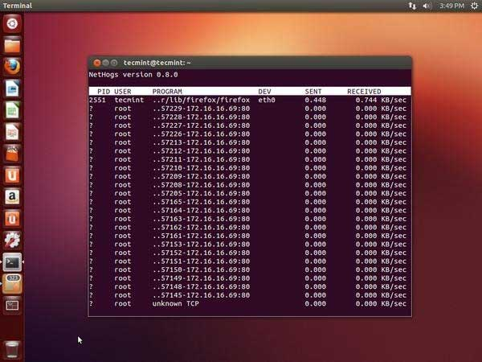

有很多适用于Linux系统的开源网络监视工具。比如说，你可以用命令iftop来检查带宽使用情况。[netstat](#/netstat "netstat命令")用来查看接口统计报告，还有[top](#/top "top命令")监控系统当前运行进程。但是如果你想要找一个能够按进程实时统计网络带宽利用率的工具，那么NetHogs值得一看。

**NetHogs**是一个开源的命令行工具（类似于Linux的top命令），用来按进程或程序实时统计网络带宽使用率。

来自NetHogs项目网站:

> NetHogs是一个小型的net top工具，不像大多数工具那样拖慢每个协议或者是每个子网的速度而是按照进程进行带宽分组。NetHogs不需要依赖载入某个特殊的内核模块。如果发生了网络阻塞你可以启动NetHogs立即看到哪个PID造成的这种状况。这样就很容易找出哪个程序跑飞了然后突然占用你的带宽。

本文为你介绍如何在Unix/Linux操作系统下如何安装和使用NetHogs按进程监控网络带宽使用率。

### 在RHEL、CentOS和Fedora下安装NetHogs  

要安装NetHogs，你必须要启用你所用Linux下的EPEL源。然后运行下面的[yum](#/yum "yum命令")命令下载安装NetHogs包。

```
# yum [install](#/install "install命令") nethogs

```

### 在Ubuntu、Linux mint和Debian下安装NetHogs  

键入[apt-get](#/apt-get "apt-get命令")命令安装NetHogs包：

```
$ [sudo](#/sudo "sudo命令") apt-get install nethogs

```

### NetHogs用法  

在基于RedHat系统下键入如下命令启动NetHogs工具。

```
# nethogs

```

在Debian/Ubuntu/Linux Mint下要执行NetHogs你必须拥有root权限：

```
$ sudo nethogs

```



Ubuntu 12.10 下的NetHogs预览

正如上图所示，send列和received列显示的是按照每个进程的流量统计。总的收发数据带宽在最下方，而且可以用交互命令控制排序，下面将要讨论这些交互命令。

### NetHogs 命令行参数  

以下就是NetHogs命令行的参数，用-d来添加刷新频率参数，device name 用来检测给定的某个或者某些设备的带宽（默认是eth0）。例如：设置5秒钟的刷新频率，键入如下命令即可：

```
# nethogs -d 5

```

```
$ sudo nethogs -d 5

```

如果只用来监视设备（eth0）的网络带宽可以使用如下命令：

```
# nethogs eth0

```

```
$ sudo nethogs eth0

```

如果要同时监视eth0和eth1接口，使用以下命令即可：

```
# nethogs eth0 eth1

```

```
$ sudo nethogs eth0 eth1

```

其他参数和用法

```
-d : 刷新间隔
-h : 帮助
-p : promiscious 模式
-t : trace模式 
-V : 版本

```

### 交互命令  

以下是NetHogs的一些交互命令（键盘快捷键）

*   m : 修改单位
*   r : 按流量排序
*   s : 按发送流量排序
*   q : 退出命令提示符

关于NetHogs命令行工具的完整参数列表，可以参考NetHogs的手册，使用方法是在终端里输入`[man](#/man "man命令") nethogs`或者`sudo man nethogs`，更多信息请参考[NetHogs项目主页](http://nethogs.sourceforge.net/)。